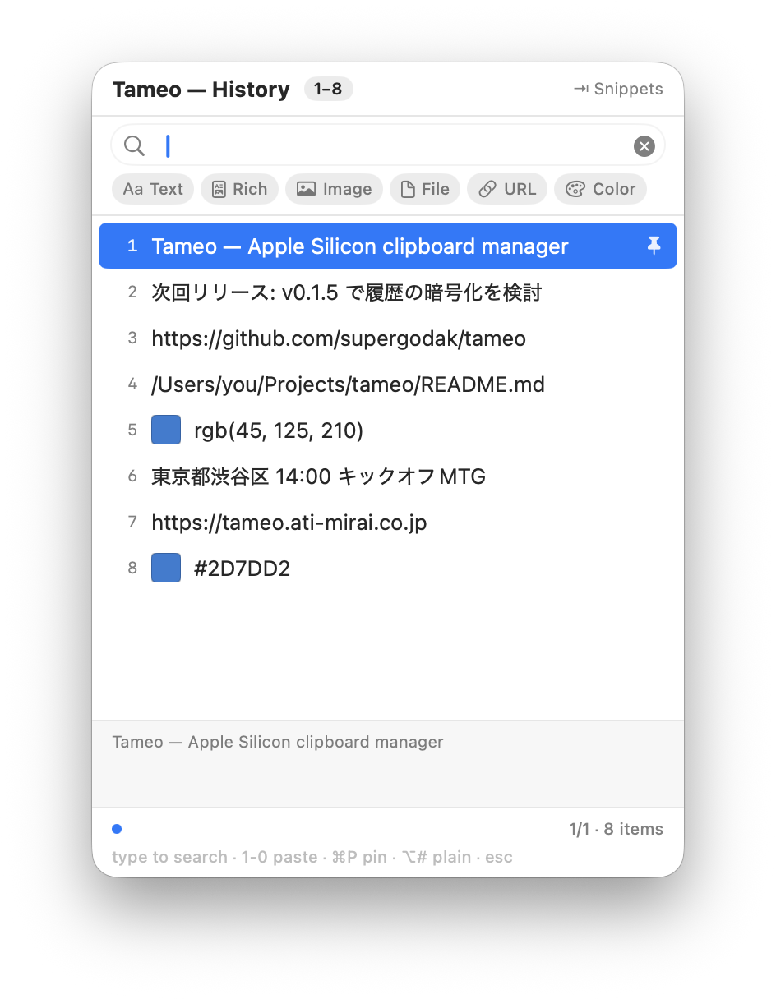
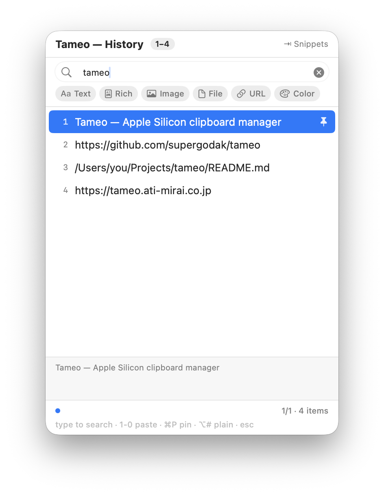

# Tameo

**A modern, native clipboard manager for macOS** — menu-bar resident, privacy-first, and built from scratch for Apple Silicon. A clean-room successor to [Clipy](https://github.com/Clipy/Clipy).

**Tameo（ためお）** は macOS 用のクリップボードマネージャです。語源は「溜める」。コピー履歴を端末内に溜めて、必要なときに前面アプリへ直接ペーストします。**完全ローカル・外部送信ゼロ。**

<p align="center">
  
  &nbsp;
  
</p>

> **Released and in active use.** Signed with a Developer ID, notarized by Apple, and auto-updating via Sparkle. Install the [latest release](https://github.com/supergodak/tameo/releases/latest) or `brew install --cask supergodak/tap/tameo`.
> 状態: **公開・実用中。** Developer ID 署名＋Apple 公証済み、Sparkle で自動更新。[最新版](https://github.com/supergodak/tameo/releases/latest) または `brew install --cask supergodak/tap/tameo` で導入できます。

🌐 Website: https://tameo.ati-mirai.co.jp  ·  📜 [Privacy Policy](PRIVACY.md)  ·  ⚖️ [MIT License](LICENSE)  ·  🍎 macOS 14+

---

## English

### Why Tameo?

[Clipy](https://github.com/Clipy/Clipy) is a beloved clipboard manager, but it ships as an **Intel-only binary that depends on Rosetta 2**, which Apple is winding down. When that ends, Clipy stops working, and the people who rely on it need a native replacement.

Tameo is that replacement — **inspired by Clipy's behavior and feature set, but written from zero with no code reuse**, on a modern Apple-Silicon-native stack (SwiftUI + SwiftData):

- **Native, no Rosetta.** Built for Apple Silicon (and Intel).
- **Completely local.** No servers, accounts, analytics, or telemetry — nothing leaves your Mac. ([Privacy Policy](PRIVACY.md))
- **Search everything, even images.** Filter your history as you type; on-device OCR lets you find (and paste) the text inside copied images and screenshots — fully local.
- **Passwords stay out.** Concealed items (`org.nspasteboard.ConcealedType`) from password managers are never saved.
- **Privacy-first monitoring.** Inspects only *what kind* of data is on the pasteboard, reading the contents only when you pick an item — built for macOS's newer pasteboard-privacy model.
- **Properly signed.** Distributed with ATI's Developer ID signature, so you grant Accessibility permission once.
- **Snippets, with Clipy import.** Bring your existing Clipy snippets across.
- **Japanese-first friendly.** JIS / kana layouts work correctly (via [Sauce](https://github.com/Clipy/Sauce)), with a Japanese UI.

### Features

- Menu-bar resident, no Dock icon
- Global hotkey (default ⌘⇧V) opens a floating palette at your cursor; press `1`–`0` to paste instantly
- Pastes the selected item into the app you were just using (layout-correct ⌘V via Sauce)
- Privacy-aware monitoring: detects only *what kind* of data is on the pasteboard; reads contents only when you pick an item
- All data types: plain text, rich text (RTF/RTFD), PDF, images (PNG/TIFF, with thumbnails), file paths, URLs, color codes (with swatches)
- Content preview before pasting
- **Search** — just start typing to filter your history. Japanese IME input works, and full/half-width and hiragana/katakana variants all match (NFKC + kana folding)
- **Pin** favorites to the top, and **filter by type** (text/rich/image/file/URL/color)
- **Image OCR** — search the text inside copied images and screenshots; press ⌥ to paste the recognized text. Runs fully on-device (Vision framework), nothing leaves your Mac
- **Snippets** — folders of reusable text, callable from the same palette (default ⌘⇧B). Import/Export, including from Clipy
- ⌥ plain-text paste (strips rich formatting)
- Full settings: history size, data-type toggles, hotkeys, login-at-startup, app exclusions

### Install

- **Direct download (notarized DMG):** grab the latest from the [project site](https://tameo.ati-mirai.co.jp) or [GitHub Releases](https://github.com/supergodak/tameo/releases/latest), then drag **Tameo** into `/Applications`.
- **Homebrew:** `brew install --cask supergodak/tap/tameo`

Requires **macOS 14+** (Apple Silicon or Intel). On first launch, grant **Accessibility** (System Settings ▸ Privacy & Security ▸ Accessibility) so Tameo can paste into the frontmost app. Updates install automatically via Sparkle.

### Build from source

The Xcode project is generated from a declarative [XcodeGen](https://github.com/yonaskolb/XcodeGen) spec (`project.yml`).

```sh
brew install xcodegen          # once
./scripts/build-app.sh         # Release build → /Applications/Tameo.app
```

Or open it in Xcode:

```sh
xcodegen generate && open Tameo.xcodeproj
```

Requires a full Xcode install. Tameo needs **Accessibility** permission (System Settings ▸ Privacy & Security ▸ Accessibility) to paste into other apps. See [CONTRIBUTING.md](CONTRIBUTING.md) for details.

### Requirements

- macOS 14 (Sonoma) or later · Apple Silicon or Intel

### Tech stack

- UI: SwiftUI `MenuBarExtra` · Persistence: SwiftData
- Key layout: [Sauce](https://github.com/Clipy/Sauce) (MIT) · Hotkeys: [KeyboardShortcuts](https://github.com/sindresorhus/KeyboardShortcuts) (MIT)
- Auto-update: [Sparkle](https://github.com/sparkle-project/Sparkle)

### License

[MIT](LICENSE) © 2026 ATI Inc. (ATI株式会社). Third-party components retain their own licenses — see [THIRD_PARTY_LICENSES.md](THIRD_PARTY_LICENSES.md).

Tameo is inspired by [Clipy](https://github.com/Clipy/Clipy) (MIT). No Clipy source code is used.

---

## 日本語

### Tameo とは

Clipy にインスパイアされた、macOS 向けのモダンなクリップボードマネージャです。メニューバー常駐・Dockアイコンなし・**完全ローカル（外部送信ゼロ）**。Apple Silicon ネイティブでゼロから作り直しています（Clipy のコードは一切流用していません）。

### なぜ作るのか

Clipy は優れたツールですが Intel バイナリのみで、Apple が縮小を進める Rosetta 2 に依存しています。Rosetta 2 が終了すると Clipy は動かなくなり、利用者はネイティブな移行先を必要とします。Tameo は挙動・機能だけを参考に、モダンな構成（SwiftUI／SwiftData）でクリーンルーム実装した後継です。

- **ネイティブ・Rosetta不要**（Apple Silicon／Intel 対応）
- **完全ローカル**：サーバー・アカウント・解析・テレメトリなし。端末から何も出ません（[プライバシーポリシー](PRIVACY.md)）
- **画像の中の文字まで検索**：入力するだけで履歴を絞り込み、オンデバイスOCRでコピー画像・スクショ内の文字も検索・貼付（完全ローカル）
- **パスワードは溜めない**：パスワードマネージャの機密項目（`org.nspasteboard.ConcealedType`）は保存しません
- **プライバシー優先の監視**：ペーストボードの「種別」だけを確認し、中身は選んだ時にだけ読む（新しい macOS のペーストボード・プライバシーの方向性に準拠）
- **正式署名**：ATI の Developer ID で署名（アクセシビリティ許可は一度だけ）
- **スニペット（Clipyインポート対応）**：既存のClipyスニペットをそのまま移行
- **日本語×JIS対応**：JIS／かな配列も正しく動作（Sauce 利用）、日本語UI

### 機能

- メニューバー常駐・Dockなし
- グローバルホットキー（既定 ⌘⇧V）でカーソル位置にパレット表示、`1`〜`0` で即ペースト
- 直前まで使っていたアプリへ貼り付け（Sauce でレイアウト補正した ⌘V を合成）
- プライバシー対応監視：ペーストボードの「種別」だけを見て、中身は選んだ時にだけ読む
- 全種別対応：テキスト／リッチテキスト／PDF／画像（サムネ付き）／ファイルパス／URL／カラーコード
- 貼り付け前の内容プレビュー
- **検索**：入力するだけで履歴を絞り込み。日本語IME入力に対応し、全角半角／ひらがなカタカナの表記ゆれも一致（NFKC＋かな畳み込み）
- **ピン留め**で最上段固定、**種別フィルタ**（テキスト／リッチ／画像／ファイル／URL／色）
- **画像OCR**：コピーした画像・スクリーンショットの中の文字で検索でき、⌥ で認識テキストを貼り付け。完全オンデバイス（Vision）で外部送信なし
- **スニペット**：定型文のフォルダ管理、同じパレットから呼び出し（既定 ⌘⇧B）。Clipy からのインポート／エクスポート対応
- ⌥ でプレーンテキスト貼付（装飾を捨てる）
- 設定：履歴件数／種別ごと保存／ホットキー／ログイン時起動／除外アプリ

### インストール

- **直接ダウンロード（公証済みDMG）:** [製品サイト](https://tameo.ati-mirai.co.jp) または [GitHub Releases](https://github.com/supergodak/tameo/releases/latest) から最新版を入手し、**Tameo** を `/Applications` にドラッグします。
- **Homebrew:** `brew install --cask supergodak/tap/tameo`

**macOS 14 以降**（Apple Silicon／Intel）。初回起動時に **アクセシビリティ**権限を許可してください（システム設定 ▸ プライバシーとセキュリティ ▸ アクセシビリティ）。前面アプリへの貼り付けに必要です。更新は Sparkle で自動配信されます。

### ソースからビルド

```sh
brew install xcodegen
./scripts/build-app.sh          # Release ビルド → /Applications/Tameo.app
```

要 Xcode（フル）。他アプリへ貼り付けるため **アクセシビリティ**権限が必要です（システム設定 ▸ プライバシーとセキュリティ ▸ アクセシビリティ）。詳細は [CONTRIBUTING.md](CONTRIBUTING.md)。

### 動作要件

- macOS 14（Sonoma）以降 · Apple Silicon／Intel

### ライセンス

[MIT](LICENSE) © 2026 ATI株式会社。第三者コンポーネントは各ライセンスに従います（[THIRD_PARTY_LICENSES.md](THIRD_PARTY_LICENSES.md)）。Tameo は [Clipy](https://github.com/Clipy/Clipy)（MIT）にインスパイアされていますが、Clipy のソースコードは使用していません。
